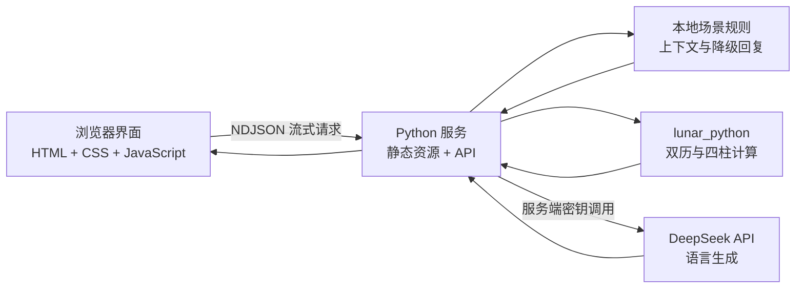

# 工位开挂局

> 不憋屈，也不把工作聊崩。

“工位开挂局”是一个把职场沟通演练、AI 对话和娱乐化八字分析结合起来的交互式 Demo。用户可以在上司高压、友善同事和阴阳同事三类场景中组织语言，观察对方反馈，再借助“八字外挂”寻找更合适的沟通角度。

[在线体验](http://38.55.131.250/stf/) · [5 分钟 HTML 路演](http://38.55.131.250/stf/roadshow.html)

> 八字内容只用于娱乐化沟通设定，不是科学人格测量，也不能用于招聘、绩效或其他真实人事决策。

## 核心体验

| 模块 | 用户能做什么 | 系统如何响应 |
| --- | --- | --- |
| 三类职场战场 | 选择上司高压局、友善同事局或阴阳同事局 | 每个场景采用不同的语气、目标和冲突策略 |
| 连续 AI 对话 | 输入自己准备发送的话，进行多轮交流 | 保留当前场景的完整上下文，先展示思考状态，再流式输出对方回复 |
| 公开分析摘要 | 查看边界、风险和工作推进建议 | 只解释可验证的沟通信号，不展示或伪造模型内部思维链 |
| 八字外挂 | 手动开启命盘沟通增益 | 根据虚构命盘假设给出雷点、开心开关和表达方式；切换场景后默认关闭 |
| 玄学分析图 | 输入姓名、历法、出生日期、时辰、性别和地点 | 先完成真实双历转换与四柱排盘，再把五行结构翻译为沟通建议 |
| 实时加深 | 把新发生的聊天加入分析 | 结合命盘初始假设和真实对话证据动态修正画像 |
| 回溯 | 在八字外挂开启后回到上一轮发送前 | 清除该轮演示消息，并把建议版本放回输入框重新组织 |
| 今日耐心余额 | 查看当天沟通带来的消耗或回血 | 按场景、表达方式和外挂状态计算变化，并保存在当前浏览器 |

## 一次完整流程

1. 选择今天面对的是上司、友善同事还是不友善同事。
2. 在聊天框输入一句自己真正想说的话。
3. 服务端生成 1–3 秒的随机揭示时间，页面显示“对方正在输入”，随后逐段输出回复。
4. 系统依据已经展示的对方原话生成公开分析和下一句建议。
5. 如需额外信息，可手动开启八字外挂，或进入全屏玄学分析图完成排盘。
6. 继续多轮聊天，让沟通画像随证据加深；需要时可使用回溯重新组织上一句话。

## 设计与响应式布局

主界面延续黄、黑、红的职场综艺漫画感，玄学空间使用黑金罗盘、星空和命盘动效形成视觉反差。移动端采用重新排版，而不是把桌面页面整体缩小：

- 手机竖屏：战场卡片横向滑动，聊天优先展示，消息在固定高度区域内上下滚动。
- 手机横屏：压缩聊天可视高度，保留输入、发送和外挂入口的完整操作空间。
- 平板：表单与结果根据宽度在单列、双列之间切换。
- 玄学排盘：四柱表格只在自身区域横向滑动，并自动定位、突出显示日主。
- 刘海屏：通过 Safe Area（安全区域，即避开刘海和底部手势条的可用范围）保护主要内容。
- 可访问性：关键触控区域不小于 44px，移动端输入字体不小于 16px，并支持 `prefers-reduced-motion`（减少动态效果的系统偏好）。

自动化验收覆盖 390×844、430×932、844×390、1024×768 和 1440×900。

## 技术架构



系统把“可确定的计算”和“开放式语言生成”分开处理：

- `lunar_python` 负责公历/农历转换、节气四柱、十神、藏干、五行表层分布和大运，模型不能改写这些计算结果。
- DeepSeek 负责对手话语、公开分析和沟通表达；模型不可用时，系统使用能承接历史上下文的本地演示结果。
- 主聊天采用两阶段单一事实源：第一阶段确定浏览器真正收到的对手原话，第二阶段只分析这句原话，不在分析阶段偷偷改写。
- DeepSeek 的 SSE（Server-Sent Events，服务端事件流）在服务端接收；浏览器端收到的是 NDJSON（Newline Delimited JSON，按行分隔的 JSON），因此文字可以边生成边显示。

## 本地运行

### 环境要求

- Python 3.10 或更高版本
- macOS、Linux，或其他能够运行 Python 的系统
- 可选：Node.js 20 或更高版本，用于浏览器自动化测试

### 快速开始

```bash
git clone https://github.com/HellowJasper/stf.git
cd stf

python3 -m venv .venv
source .venv/bin/activate
python3 -m pip install -r requirements.txt
python3 server.py
```

打开以下地址：

- 产品 Demo：<http://127.0.0.1:4173/>
- 5 分钟路演：<http://127.0.0.1:4173/roadshow.html>

不要使用 `python3 -m http.server`。该命令只能提供静态文件，无法运行排盘、随机等待、连续对话和流式接口。

## DeepSeek 配置

没有配置模型密钥时，项目仍可使用本地演示引擎完成主要流程。配置后，服务端会调用 DeepSeek 生成更自然的随机对话与分析。

### 环境变量

| 变量 | 默认值 | 含义 |
| --- | --- | --- |
| `DEEPSEEK_API_KEY` | 无 | DeepSeek 的 API Key（应用程序接口密钥），只允许保存在服务端 |
| `DEEPSEEK_MODEL` | `deepseek-v4-pro` | 项目默认传递的模型标识；实际可用型号取决于 API 账户与服务配置，可自行覆盖 |
| `DEEPSEEK_BASE_URL` | `https://api.deepseek.com` | DeepSeek 接口基础地址 |
| `DEEPSEEK_DISABLE_KEYCHAIN` | 未设置 | 设为 `1` 时，禁止在 macOS 钥匙串中查找密钥 |
| `STF_HOST` | `127.0.0.1` | Python 服务监听地址 |
| `STF_PORT` | `4173` | Python 服务监听端口 |

macOS 临时配置：

```bash
export DEEPSEEK_API_KEY="替换为你自己的 Key"
export DEEPSEEK_MODEL="deepseek-v4-pro"
python3 server.py
```

macOS 钥匙串配置：

```bash
security add-generic-password \
  -U \
  -a "stf-demo" \
  -s "stf-deepseek-api-key" \
  -w "替换为你自己的 Key"
```

密钥读取顺序为：环境变量 → macOS 钥匙串 → 本地演示引擎。API Key 不会出现在前端文件或 `/api/config` 响应中，也不应提交到 GitHub。

## 接口说明

| 方法与路径 | 用途 | 返回方式 |
| --- | --- | --- |
| `GET /api/health` | 服务健康检查 | JSON |
| `GET /api/config` | 返回前端可公开的引擎状态 | JSON，不包含密钥 |
| `POST /api/respond` | 连续职场对话、公开分析和下一句建议 | NDJSON 流 |
| `POST /api/mystic-profile` | 根据输入资料排盘并生成沟通画像 | JSON |
| `POST /api/live-analysis` | 根据新增聊天加深当前画像 | JSON |

## 八字排盘口径

玄学分析图按 [`jinchenma94/bazi-skill`](https://github.com/jinchenma94/bazi-skill) 的输入结构收集姓名、曾用名、历法、生日、时间精度、性别、出生地和在世状态，并使用 `lunar_python==1.4.8` 计算命盘。

- 四柱：年柱、月柱、日柱、时柱四组干支。
- 日主：日柱天干，页面会将其作为命盘分析中心格外突出。
- 十神：其他干支相对日干的生克关系名称。
- 藏干：传统命理中每个地支内部所含的天干。
- 大运：传统命理中按十年分段的运程序列。

农历输入会先转换为对应公历时刻，再按照节气边界计算年柱和月柱；23:00 之后按项目采用的早子时口径换日。命理解释属于传统文化娱乐内容，不代表科学结论。

## 今日耐心余额

当天首次进入为 68 点。每轮对话由服务端根据场景、表达方式和外挂状态返回可解释的变化：友善协作可能回血，高压或阴阳沟通会消耗，清晰边界和外挂建议会减少损耗，成功回溯返还 4 点“后悔税”。

余额和最多 20 条流水保存在浏览器 `localStorage`（本地存储）中，刷新后仍保留，日期变化后自动重置。点击顶部余额卡可以查看或手动重置当天明细。

## 测试

运行 Python 单元测试与接口测试：

```bash
python3 -m unittest discover -s tests -p 'test_*.py' -v
```

浏览器测试需要在当前 Node.js 环境中安装 Playwright（浏览器自动化测试库）及 Chromium：

```bash
npm install --no-save --package-lock=false playwright
npx playwright install chromium

node tests/verify_reported_regressions.cjs
node tests/verify_live_multiturn.cjs
node tests/verify_mobile.cjs
node tests/verify_ui.cjs
node tests/verify_roadshow.cjs
```

使用其他地址进行验收：

```bash
DEMO_URL=http://127.0.0.1:4173/ node tests/verify_mobile.cjs
```

## 5 分钟 HTML 路演

`roadshow.html` 共 8 页，建议时长合计 300 秒。快捷键如下：

- `←` / `→` 或空格：切换页面。
- `N`：显示或隐藏逐页演讲提示。
- `F`：进入或退出浏览器全屏。
- `A`：开启或关闭按建议时长自动翻页。
- `R`：返回第一页并重新开始计时。

## 项目结构

```text
stf/
├── index.html                  # 产品页面语义结构
├── styles.css                 # 主界面、玄学空间与响应式视觉
├── script.js                  # 场景、聊天、外挂、排盘和回溯交互
├── server.py                  # 静态服务、流式 API、排盘和模型代理
├── roadshow.html              # 5 分钟路演页面
├── roadshow.css
├── roadshow.js
├── requirements.txt           # Python 依赖
├── prompts/                   # 职场对话系统提示词
├── deploy/                    # systemd 与 Nginx 部署配置
├── tests/                     # 单元、接口和浏览器验收测试
└── assets/                    # 设计参考资源
```

## Ubuntu 服务器部署

生产演示使用 Nginx + systemd：Nginx 是反向代理，负责把 `/stf/` 请求转发到只监听本机的 Python 服务；systemd 是 Linux 服务管理器，负责开机启动、异常重启和日志收集。

仓库提供：

- `deploy/stf.service`：后台服务定义，默认从 `/srv/stf` 启动。
- `deploy/nginx-stf-location.conf`：Nginx 的 `/stf/` 路由片段。

服务端环境文件建议放在 `/etc/stf/stf.env`，权限设置为 `600`：

```text
STF_HOST=127.0.0.1
STF_PORT=4173
DEEPSEEK_MODEL=deepseek-v4-pro
DEEPSEEK_API_KEY=由服务器安全注入，禁止提交到 GitHub
```

部署后验证：

```bash
systemctl status stf.service
curl http://127.0.0.1:4173/api/health
curl http://127.0.0.1/stf/api/health
```

## 数据与安全边界

- 八字信息只作为娱乐化角色设定，不用于判断真实人格、招聘、绩效或重大关系决策。
- 配置 DeepSeek 后，聊天内容和用于玄学分析的资料会发送给所配置的模型服务。使用真实资料前应取得授权，并避免输入公司秘密、身份证号、联系方式等敏感信息。
- “回怼”被约束为明确边界、锁定事实和推动工作，不生成侮辱、威胁或职场霸凌内容。
- 回溯只改变当前 Demo 的浏览器状态，不能撤回微信、飞书等真实聊天软件里的消息。
- 模型不可用时会自动使用本地演示结果，但不会伪造历法排盘数据。
- 三个场景的聊天历史只保存在当前页面会话中，刷新页面后会清空；只有“今日耐心余额”会写入浏览器本地存储。
- 当前公网配置是产品 Demo，没有内置账号登录、接口鉴权或请求限流。正式对外服务前，应在反向代理或应用层补充 HTTPS、身份认证、调用频率限制和模型额度保护。

## License

当前仓库尚未声明开源许可证。未经仓库所有者明确授权，请勿将代码视为可自由复制、修改或商用的开源项目。
