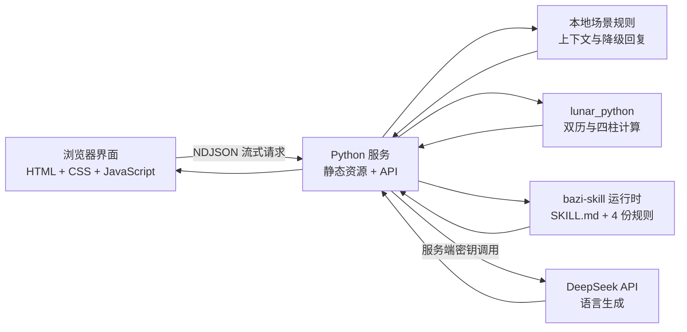

# 🧧 工位开挂局

> 白天已经够像牛马了，发消息前，至少让自己开一挂。

**把那句“收到”前面的 10,000 字内心戏，翻译成一条既解气、又能把活往前推的消息。**

你可能经历过这种工位惊悚片：

> **王总：**“这点小事为什么还没做完？今晚给我。”
>
> **你脑内：**“需求改了八遍，服务器都比你讲道理。”
>
> **你发出：**“收到。”

`工位开挂局` 就卡在“脑内”和“发出”中间：让 AI 陪你过招，再加一点娱乐化八字设定，帮你把情绪翻译成边界，把窝火翻译成能落地的话。

[⚡ 现在就开一局](http://38.55.131.250/stf/) · [🎤 偷看 5 分钟路演](http://38.55.131.250/stf/roadshow.html)

> **先说人话：**这不是“赛博算命招聘器”。八字只负责增加戏剧效果，不能拿来判断真实人格，更不能用于招聘、绩效或重大决策。

## 今天抽到什么职场副本？

| 副本 / 道具 | 你来干什么 | 爽点在哪里 |
| --- | --- | --- |
| 🎭 三大战场 | 挑选上司高压局、友善同事局或阴阳同事局 | 同一句话，面对不同人不再只会复制粘贴 |
| 🧠 连续 AI 对话 | 把你真正想说的话发进去，多聊几轮 | 对面会承接上下文，不会每轮都像第一次见你 |
| 🔍 公开分析摘要 | 看清对方在压什么、躲什么、想拿什么结果 | 不偷看“思维链”，只拆可验证的语气、目标和风险 |
| 🧧 八字外挂 | 手动加载虚构命盘增益 | 提前看雷点、开心开关和更容易被接住的表达方式 |
| 🌀 玄学分析图 | 输入生辰资料，看罗盘流转、命盘落定 | 真排盘负责定结构，AI 负责把术语翻译成人话 |
| 📈 实时加深 | 把刚发生的聊天继续喂给分析 | 命盘只是开局假设，真实聊天证据才有最终解释权 |
| 🔁 回溯 | 回到上一轮发送前，重新组织语言 | 现实没有撤回药，Demo 里先少交一点“后悔税” |
| 🔋 今日耐心余额 | 看今天还剩多少情绪电量 | 高压掉血、清晰边界减伤、友善协作回血 |

## 开一局，只要六步

1. **选副本：**今天来的是临时加活的上司、热心同事，还是阴阳怪气选手？
2. **先出招：**在聊天框输入一句你真的准备发出去的话。
3. **时间静止：**系统随机思考 1–3 秒；对方正在输入，你的血压也正在读条。
4. **开始拆招：**对方回复逐段出现，下面同步给出公开分析和下一句建议。
5. **选择开挂：**手动开启八字外挂，或者进入玄学分析图完成一次黑金罗盘排盘。
6. **允许后悔：**继续多轮对话；说歪了就发动回溯，把上一句拿回来重写。

## 手机不是缩小版，是重新排位

主界面是黄、黑、红的职场综艺漫画感；一脚踏进玄学空间后，画风切到黑金罗盘、星空和命盘动效。移动端采用重新排版，而不是把桌面页面硬塞进手机：

- 手机竖屏：战场卡片横向滑动，聊天优先展示，消息在固定高度区域内上下滚动。
- 手机横屏：压缩聊天可视高度，保留输入、发送和外挂入口的完整操作空间。
- 平板：表单与结果根据宽度在单列、双列之间切换。
- 玄学排盘：四柱表格只在自身区域横向滑动，并自动定位、突出显示日主。
- 刘海屏：通过 Safe Area（安全区域，即避开刘海和底部手势条的可用范围）保护主要内容。
- 可访问性：关键触控区域不小于 44px，移动端输入字体不小于 16px，并支持 `prefers-reduced-motion`（减少动态效果的系统偏好）。

目前自动化验收覆盖 390×844、430×932、844×390、1024×768 和 1440×900。手机能开挂，平板能排盘，电脑当然也不能掉链子。

## 技术可以玄学，计算不能随缘



这里有一条底线：**能算出来的交给代码，适合发挥的才交给模型。**

- `lunar_python` 负责公历/农历转换、节气四柱、十神、藏干、五行表层分布和大运，模型不能改写这些计算结果。
- 出生地不再只是一个展示字段：服务会优先识别内置城市的经度与 IANA 时区（时区数据库名称，例如 `Asia/Shanghai`），也支持手填经度。它以民用时间叠加经度差与均时差（地球公转造成的太阳时微小修正）得到真太阳时，再用同一历法引擎重排四柱。
- 结果页会同时保留民用时间盘与真太阳时盘。若校正跨越节气、日界或时辰边界，日柱/时柱会明确标红为“边界变化”；否则标为“四柱稳定”。未知时辰不伪造精确校正，只展示六字结构并提示复核。
- `jinchenma94/bazi-skill` 不是可 `import` 的 Python SDK（软件开发工具包），而是一套 Markdown 规则契约。本项目把指定提交的 `SKILL.md` 与 4 份参考文件固化到 `vendor/bazi-skill/`，启动时逐份读取并校验 SHA-256（256 位文件指纹）；任一文件缺失或被改动，服务会直接拒绝启动，不能再拿一行静态文案假装“已接入”。
- 程序按 Skill 的分析顺序落实月令、得令/得地/得势、格局、喜忌、调候、大运、流年和历史校准；前端结果页会展示实际加载的版本、4/4 文件清单与分析来源。
- DeepSeek 负责对手话语、公开分析和沟通表达；模型临时摸鱼时，系统会让能承接历史上下文的本地演示引擎顶班。
- 主聊天采用两阶段单一事实源：第一阶段确定浏览器真正收到的对手原话，第二阶段只分析这句原话，不在分析阶段偷偷改写。
- DeepSeek 的 SSE（Server-Sent Events，服务端事件流）在服务端接收；浏览器端收到的是 NDJSON（Newline Delimited JSON，按行分隔的 JSON），因此文字可以边生成边显示。

## 三分钟开局，不用先看黄历

### 环境要求

- Python 3.10 或更高版本
- macOS、Linux，或其他能够运行 Python 的系统
- 可选：Node.js 20 或更高版本，用于浏览器自动化测试

### 开跑

```bash
git clone https://github.com/HellowJasper/stf.git
cd stf

python3 -m venv .venv
source .venv/bin/activate
python3 -m pip install -r requirements.txt
python3 server.py
```

打开以下地址：

- 产品 Demo：<http://127.0.0.1:4173/>
- 5 分钟路演：<http://127.0.0.1:4173/roadshow.html>

不要偷懒改用 `python3 -m http.server`：它只会端上一盘静态文件，排盘、随机等待、连续对话和流式输出都会集体旷工。

## 请 AI 上桌（可选）

没配模型密钥也能玩，本地演示引擎会稳稳接班；配置后，服务端会请 DeepSeek 上桌，让对手回复和分析更自然、更不按台词本出牌。

### 环境变量

| 变量 | 默认值 | 含义 |
| --- | --- | --- |
| `DEEPSEEK_API_KEY` | 无 | DeepSeek 的 API Key（应用程序接口密钥），只允许保存在服务端 |
| `DEEPSEEK_MODEL` | `deepseek-v4-pro` | 项目默认传递的模型标识；实际可用型号取决于 API 账户与服务配置，可自行覆盖 |
| `DEEPSEEK_BASE_URL` | `https://api.deepseek.com` | DeepSeek 接口基础地址 |
| `DEEPSEEK_DISABLE_KEYCHAIN` | 未设置 | 设为 `1` 时，禁止在 macOS 钥匙串中查找密钥 |
| `STF_HOST` | `127.0.0.1` | Python 服务监听地址 |
| `STF_PORT` | `4173` | Python 服务监听端口 |

macOS 临时配置：

```bash
export DEEPSEEK_API_KEY="替换为你自己的 Key"
export DEEPSEEK_MODEL="deepseek-v4-pro"
python3 server.py
```

macOS 钥匙串配置：

```bash
security add-generic-password \
  -U \
  -a "stf-demo" \
  -s "stf-deepseek-api-key" \
  -w "替换为你自己的 Key"
```

密钥读取顺序为：环境变量 → macOS 钥匙串 → 本地演示引擎。API Key 不会出现在前端文件或 `/api/config` 响应中，也不应提交到 GitHub。

## 接口暗号

| 方法与路径 | 用途 | 返回方式 |
| --- | --- | --- |
| `GET /api/health` | 服务健康检查 | JSON |
| `GET /api/config` | 返回前端可公开的引擎状态 | JSON，不包含密钥 |
| `POST /api/respond` | 连续职场对话、公开分析和下一句建议 | NDJSON 流 |
| `POST /api/mystic-profile` | 根据输入资料排盘并生成沟通画像 | JSON |
| `POST /api/live-analysis` | 根据新增聊天加深当前画像 | JSON |

## 八字怎么算：不是让 AI 现场编

玄学分析图真实加载 [`jinchenma94/bazi-skill`](https://github.com/jinchenma94/bazi-skill) 的运行时规则。当前固化版本为提交 `bdd7f863d4450bf0e2fac84579ad6b45cfdfa25c`：`SKILL.md` 与 `wuxing-tables.md`、`shichen-table.md`、`dayun-rules.md`、`classical-texts.md` 四份参考文件都会在服务启动时读取并做完整性校验。

职责不是一锅炖：`lunar_python==1.4.8` 负责确定性历法排盘，Skill 负责结构化命理解读，DeepSeek 只把已经确定的结论翻译成办公室里能发的话。DeepSeek 不能覆盖日主、旺衰、格局、喜忌、大运或流年；发送给语言模型的对象信息也只保留姓名与在世状态，不包含原始生日、出生时刻或出生地点。

这里实现的是 **Skill 的职场沟通适配子集**：保留四柱、旺衰、格局、喜忌、调候、大运、流年与历史校准，但不扩写婚姻、健康、财富吉凶等与 Demo 无关的断语。没实现的范围会明确留白，不让 AI 自己补一段“天机”。

- 四柱：年柱、月柱、日柱、时柱四组干支。
- 日主：日柱天干，页面会将其作为命盘分析中心格外突出。
- 十神：其他干支相对日干的生克关系名称。
- 藏干：传统命理中每个地支内部所含的天干。
- 大运：传统命理中按十年分段的运程序列。

农历输入会先转换为对应公历时刻，再按照节气边界计算年柱和月柱；23:00–24:00 按 Skill 的晚子时口径归入次日日柱。换句话说，罗盘可以很玄，日期不能乱算。命理解释属于传统文化娱乐内容，不代表科学结论。

## 今日耐心余额：68 分，不多但能撑

当天首次进入为 68 点——毕竟满电上班不符合世界观。每轮对话由服务端根据场景、表达方式和外挂状态返回可解释的变化：友善协作可能回血，高压或阴阳沟通会消耗，清晰边界和外挂建议会减少损耗，成功回溯返还 4 点“后悔税”。

余额和最多 20 条流水保存在浏览器 `localStorage`（本地存储）中，刷新后仍保留，日期变化后自动重置。点击顶部余额卡可以查看或手动重置当天明细。

## 命理可以娱乐，测试不能随缘

按钮会亮只是第一关。测试还会检查连续对话是否真的记得前文、农历是否能够排盘、移动端有没有横向溢出、聊天区是否只在内部滚动，以及日主有没有被正确定位和突出显示。

运行 Python 单元测试与接口测试：

```bash
python3 -m unittest discover -s tests -p 'test_*.py' -v
```

浏览器测试需要在当前 Node.js 环境中安装 Playwright（浏览器自动化测试库）及 Chromium：

```bash
npm install --no-save --package-lock=false playwright
npx playwright install chromium

node tests/verify_reported_regressions.cjs
node tests/verify_live_multiturn.cjs
node tests/verify_mobile.cjs
node tests/verify_ui.cjs
node tests/verify_roadshow.cjs
```

使用其他地址进行验收：

```bash
DEMO_URL=http://127.0.0.1:4173/ node tests/verify_mobile.cjs
```

## 5 分钟路演：老板的茶还没凉

`roadshow.html` 共 8 页，建议时长合计刚好 300 秒。讲完产品，老板的茶大概率还热着。快捷键如下：

- `←` / `→` 或空格：切换页面。
- `N`：显示或隐藏逐页演讲提示。
- `F`：进入或退出浏览器全屏。
- `A`：开启或关闭按建议时长自动翻页。
- `R`：返回第一页并重新开始计时。

## 项目结构：案发现场

```text
stf/
├── index.html                  # 产品页面语义结构
├── styles.css                 # 主界面、玄学空间与响应式视觉
├── script.js                  # 场景、聊天、外挂、排盘和回溯交互
├── server.py                  # 静态服务、流式 API、排盘和模型代理
├── roadshow.html              # 5 分钟路演页面
├── roadshow.css
├── roadshow.js
├── requirements.txt           # Python 依赖
├── prompts/                   # 职场对话系统提示词
├── vendor/bazi-skill/         # 固化并校验的 Skill 契约与 4 份规则参考
├── deploy/                    # systemd 与 Nginx 部署配置
├── tests/                     # 单元、接口和浏览器验收测试
└── assets/                    # 设计参考资源
```

## 上服务器：让它 24 小时替你值班

生产演示使用 Nginx + systemd：Nginx 是反向代理，负责把 `/stf/` 请求转发到只监听本机的 Python 服务；systemd 是 Linux 服务管理器，负责开机启动、异常重启和日志收集。

说人话就是：

- **Nginx：**门口前台，把 `/stf/` 请求领到正确工位。
- **Python 服务：**真正负责聊天、流式输出和排盘的打工人。
- **systemd：**值班经理，服务一旦躺平，就负责把它重新叫醒。

仓库提供：

- `deploy/stf.service`：后台服务定义，默认从 `/srv/stf` 启动。
- `deploy/nginx-stf-location.conf`：Nginx 的 `/stf/` 路由片段。

服务端环境文件建议放在 `/etc/stf/stf.env`，权限设置为 `600`：

```text
STF_HOST=127.0.0.1
STF_PORT=4173
DEEPSEEK_MODEL=deepseek-v4-pro
DEEPSEEK_API_KEY=由服务器安全注入，禁止提交到 GitHub
```

部署后验证：

```bash
systemctl status stf.service
curl http://127.0.0.1:4173/api/health
curl http://127.0.0.1/stf/api/health
```

## 爽归爽，边界必须守住

- 八字信息只作为娱乐化角色设定，不用于判断真实人格、招聘、绩效或重大关系决策。
- 配置 DeepSeek 后，聊天内容、对象称呼和去标识化命盘结构会发送给所配置的模型服务；原始出生日期、时刻和地点只在应用后端用于排盘，发给模型前会被剥离。即便如此，使用真实资料前仍应取得授权，并避免输入公司秘密、身份证号、联系方式等敏感信息。
- “回怼”被约束为明确边界、锁定事实和推动工作，不生成侮辱、威胁或职场霸凌内容。
- 回溯只改变当前 Demo 的浏览器状态，不能撤回微信、飞书等真实聊天软件里的消息。
- 模型不可用时会自动使用本地演示结果，但不会伪造历法排盘数据。
- 三个场景的聊天历史只保存在当前页面会话中，刷新页面后会清空；只有“今日耐心余额”会写入浏览器本地存储。
- 当前公网配置是产品 Demo，没有内置账号登录、接口鉴权或请求限流。正式对外服务前，应在反向代理或应用层补充 HTTPS、身份认证、调用频率限制和模型额度保护。

## 开源状态

当前仓库尚未声明开源许可证。未经仓库所有者明确授权，请勿将代码视为可自由复制、修改或商用的开源项目。
