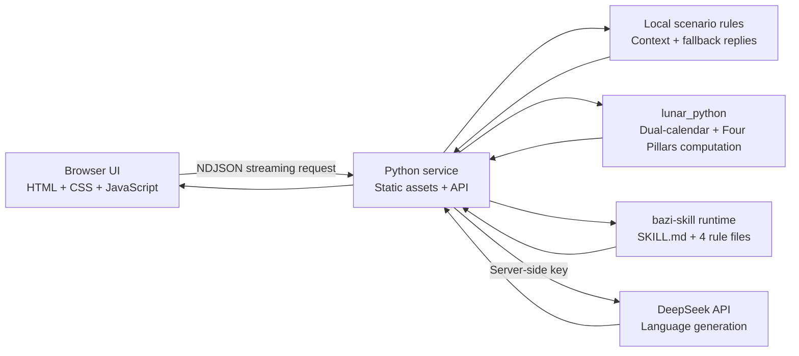

[English](README.md) | [简体中文](README.zh-CN.md)

# 🧧 Workplace Power-Up (STF)

> An AI assistant and public reference implementation for Chinese-language workplace communication: turn emotionally charged drafts into messages with clear boundaries and actionable next steps.

**STF (Workplace Power-Up)** is a public reference application for safer Chinese workplace communication. It combines stateful streamed role-play, evidence-based message analysis, deterministic calendar computation, privacy-aware data separation, offline fallback, and automated API and browser tests.

[⚡ Try the Live Demo](http://38.55.131.250/stf/) · [🎤 View the 5-Minute Roadshow](http://38.55.131.250/stf/roadshow.html)

## What problem does this project solve?

Real workplace communication is rarely just about “not knowing how to phrase one sentence.” It often requires you to manage emotions, facts, relationships, and action boundaries at the same time. STF adds an inspectable AI collaboration layer between what is in your head and the message you ultimately send:

- **Turn emotion into action.** Preserve the user's real intent while rewriting aggressive or ambiguous language into a message that confirms facts, establishes boundaries, and moves the work forward.
- **Maintain context across multiple turns.** The counterpart's replies, evidence-based analysis, and suggested next message keep evolving around the same real conversation instead of restarting every turn.
- **Analyze only observable evidence.** The system explains tone, goals, and risks without exposing hidden chain-of-thought or presenting model speculation as fact.
- **Separate deterministic computation from model generation.** Calendar and Four Pillars calculations are performed in code. The language model handles wording and communication guidance, but it cannot override computed results.
- **Preserve privacy and graceful-degradation boundaries.** Model keys stay on the server. If the model is unavailable, a local demo engine takes over so that the core interaction remains testable.
- **Provide reproducible tests.** The project includes automated acceptance scripts for the API, continuous conversations, mobile layouts, visual behavior, and the roadshow page.

## Project scope and boundaries

The optional Bazi module—also known as the Chinese Four Pillars of Destiny (八字 / 四柱), a traditional system that interprets birth-time calendar structures—is included as a cultural-entertainment layer for richer role-play and presentation. It must not be used to infer a real person's personality or to make hiring, performance, medical, legal, or other consequential decisions.

The project's actual focus is how to build a Chinese-language AI communication application that is context-aware, explainable, resilient when external models fail, and verifiable through automation.

## Which workplace scenario did you draw today?

| Scenario / power-up | What you do | Why it helps |
| --- | --- | --- |
| 🎭 Three battlegrounds | Choose a high-pressure manager, a friendly coworker, or a passive-aggressive coworker | The same sentence no longer has to be copied and pasted to three very different people |
| 🧠 Continuous AI conversation | Send what you genuinely want to say and continue for several rounds | The other side carries context forward instead of meeting you “for the first time” every turn |
| 🔍 Evidence-based analysis | See what the other person is pressuring, avoiding, and trying to achieve | No hidden chain-of-thought—only observable tone, goals, and risks |
| 🧧 Bazi power-up | Manually load a fictional Four Pillars profile | Preview likely friction points, positive triggers, and phrasing that may be easier for the character to accept |
| 🌀 Mystic analysis chart | Enter birth details and watch the compass animate while the chart is calculated | Real calendar computation determines the structure; AI translates specialist terms into plain language |
| 📈 Live refinement | Feed new messages into the current analysis | The chart is only an opening hypothesis; evidence from the real conversation always has the final say |
| 🔁 Rewind | Return to the state before your previous message and rewrite it | Reality has no undo potion, but the demo can reduce a little “regret tax” |
| 🔋 Today's patience balance | Check how much emotional energy you have left today | Pressure drains it, clear boundaries reduce damage, and constructive collaboration restores it |

## Start a session in six steps

1. **Choose a scenario:** Is today's encounter a manager assigning urgent extra work, a helpful coworker, or someone being passive-aggressive?
2. **Make the first move:** Enter a sentence you are genuinely considering sending.
3. **Freeze time:** The system waits for a random 1–3 seconds. The other person is “typing,” and your blood pressure is loading too.
4. **Read the counterplay:** The reply streams in piece by piece, accompanied by evidence-based analysis and a suggested next message.
5. **Use a power-up:** Manually enable the Bazi power-up, or enter the mystic analysis chart to run the black-and-gold compass calculation.
6. **Allow yourself a redo:** Continue the multi-turn conversation. If the message goes sideways, use Rewind to take back the previous line and rewrite it.

## Mobile is not a shrunken desktop—it is reprioritized

The main interface uses a yellow, black, and red workplace-variety-show comic style. Enter the mystic space and the visual language shifts to a black-and-gold compass, a star field, and animated chart elements. Mobile uses a redesigned layout instead of squeezing the desktop page into a smaller screen:

- Portrait phones: scenario cards scroll horizontally, chat takes priority, and messages scroll vertically within a fixed-height area.
- Landscape phones: the visible chat height is compressed while preserving full access to input, send, and power-up controls.
- Tablets: forms and results switch between one- and two-column layouts based on available width.
- Mystic chart: the Four Pillars table scrolls horizontally only within its own region, automatically locating and highlighting the Day Master.
- Notched displays: Safe Area insets protect key content from the notch and bottom gesture bar.
- Accessibility: critical touch targets are at least 44 px, mobile input text is at least 16 px, and the interface respects `prefers-reduced-motion`, the operating-system preference for reduced animation.

Automated acceptance coverage currently includes 390×844, 430×932, 844×390, 1024×768, and 1440×900. The power-up works on phones, the chart works on tablets, and desktop cannot be the weak link.

## The interface may be mystical; computation must not be guesswork



There is one non-negotiable rule: **if code can calculate it, code owns it; only genuinely generative work goes to the model.**

- `lunar_python` handles Gregorian/lunar calendar conversion, solar-term-based Four Pillars, Ten Gods, Hidden Stems, surface-level Five Elements distribution, and Luck Pillars. The model cannot rewrite these computed results.
- Birthplace is not merely a display field. The service first tries to resolve an included city's longitude and IANA time zone (a standard database identifier such as `Asia/Shanghai`), and it also accepts a manually entered longitude. It adjusts civil time using the longitude difference and the equation of time—the small solar-time correction caused by Earth's orbit—then recomputes the Four Pillars with the same calendar engine.
- The result page preserves both the civil-time chart and the true-solar-time chart. If the correction crosses a solar term, calendar-day boundary, or traditional two-hour boundary, the affected Day Pillar or Hour Pillar is explicitly marked as a “boundary change”; otherwise, the chart is marked “Four Pillars stable.” When the birth hour is unknown, the system does not fabricate a precise correction. It displays only the six available characters—the Year, Month, and Day Pillars—and asks the user to verify the missing hour.
- `jinchenma94/bazi-skill` is not an importable Python SDK (software development kit). It is a Markdown-based rules contract. This project pins a specific commit of `SKILL.md` and four reference files under `vendor/bazi-skill/`. At startup, it loads every file and validates its SHA-256 hash, a 256-bit file fingerprint. If any file is missing or modified, the service refuses to start instead of pretending that a static sentence represents a working integration.
- The implementation follows the Skill's sequence: assess the Month Command (月令, the chart's seasonal anchor); evaluate whether the Day Master is supported by season, roots, and surrounding stems and branches; then determine pattern classification, favorable and unfavorable elements, climate balancing, Luck Pillars, annual cycles, and historical calibration. The frontend displays the exact loaded version, the 4/4 file checklist, and the sources used in the analysis.
- DeepSeek generates counterpart dialogue, evidence-based analysis, and communication wording. If the model is temporarily unavailable, a local demo engine that still understands the conversation history takes over.
- Main chat uses a two-stage single source of truth: stage one fixes the exact counterpart message received by the browser; stage two analyzes only that message and cannot secretly rewrite it.
- DeepSeek's SSE (Server-Sent Events, a server-to-client event stream) is consumed on the server. The browser receives NDJSON (Newline Delimited JSON, one JSON object per line), allowing text to appear as it is generated.

## Three-minute setup—no almanac required

### Requirements

- Python 3.10 or later
- macOS, Linux, or another operating system capable of running Python
- Optional: Node.js 20 or later for browser automation tests

### Run

```bash
git clone https://github.com/HellowJasper/stf.git
cd stf

python3 -m venv .venv
source .venv/bin/activate
python3 -m pip install -r requirements.txt
python3 server.py
```

Open:

- Product demo: <http://127.0.0.1:4173/>
- 5-minute roadshow: <http://127.0.0.1:4173/roadshow.html>

Do not take the shortcut of using `python3 -m http.server`. It only serves static files, which means chart calculation, randomized delay, continuous conversation, and streaming output will all be absent.

## Bring AI to the table (optional)

The application works without a model key: the local demo engine takes over. Once configured, the server invites DeepSeek to the table so counterpart replies and analysis are more natural and less dependent on a fixed script.

### Environment variables

| Variable | Default | Meaning |
| --- | --- | --- |
| `DEEPSEEK_API_KEY` | None | DeepSeek API key; it must remain on the server |
| `DEEPSEEK_MODEL` | `deepseek-v4-pro` | Model identifier passed by default; actual availability depends on the API account and service configuration and can be overridden |
| `DEEPSEEK_BASE_URL` | `https://api.deepseek.com` | DeepSeek API base URL |
| `DEEPSEEK_DISABLE_KEYCHAIN` | Unset | Set to `1` to disable macOS Keychain lookup |
| `STF_HOST` | `127.0.0.1` | Address on which the Python service listens |
| `STF_PORT` | `4173` | Port on which the Python service listens |

Temporary macOS configuration:

```bash
export DEEPSEEK_API_KEY="REPLACE_WITH_YOUR_OWN_KEY"
export DEEPSEEK_MODEL="deepseek-v4-pro"
python3 server.py
```

macOS Keychain configuration:

```bash
security add-generic-password \
  -U \
  -a "stf-demo" \
  -s "stf-deepseek-api-key" \
  -w "REPLACE_WITH_YOUR_OWN_KEY"
```

The key lookup order is: environment variable → macOS Keychain → local demo engine. The API key is never included in frontend files or the `/api/config` response, and it must not be committed to GitHub.

## API endpoints

| Method and path | Purpose | Response |
| --- | --- | --- |
| `GET /api/health` | Service health check | JSON |
| `GET /api/config` | Return publicly safe frontend engine status | JSON, without secrets |
| `POST /api/respond` | Continuous workplace dialogue, evidence-based analysis, and next-message suggestion | NDJSON stream |
| `POST /api/mystic-profile` | Calculate a chart from the provided details and generate a communication profile | JSON |
| `POST /api/live-analysis` | Refine the current profile using newly added chat messages | JSON |

## How Bazi is calculated—it is not improvised live by AI

The mystic analysis chart loads the runtime rules from [`jinchenma94/bazi-skill`](https://github.com/jinchenma94/bazi-skill). The currently pinned version is commit `bdd7f863d4450bf0e2fac84579ad6b45cfdfa25c`. At service startup, `SKILL.md` and the four reference files—`wuxing-tables.md`, `shichen-table.md`, `dayun-rules.md`, and `classical-texts.md`—are loaded and integrity-checked.

Responsibilities are deliberately separated. `lunar_python==1.4.8` performs deterministic calendar and chart computation. The Skill supplies structured interpretation under the traditional Bazi framework. DeepSeek only translates already established conclusions into wording that can be used in a workplace message. DeepSeek cannot override the Day Master, strength assessment, pattern classification, favorable or unfavorable elements, Luck Pillars, or annual cycles. Information about the other person sent to the language model is limited to their name and whether they are living; raw birth date, birth time, and birthplace are excluded.

This implementation is a **workplace-communication subset of the Skill**. It retains Four Pillars, strength assessment, pattern classification, favorable and unfavorable elements, climate balancing, Luck Pillars, annual cycles, and historical calibration, but does not expand into claims about marriage, health, wealth, fortune, or misfortune that are unrelated to the demo. Unimplemented areas remain explicitly blank instead of inviting AI to invent “heavenly secrets.”

- **Four Pillars (四柱, Sì Zhù):** four pairs of Heavenly Stems and Earthly Branches representing the year, month, day, and hour.
- **Day Master (日主, Rì Zhǔ):** the Heavenly Stem of the Day Pillar; the interface highlights it as the center of chart interpretation.
- **Ten Gods (十神, Shí Shén):** traditional relationship categories derived from how the other stems and branches interact with the Day Stem.
- **Hidden Stems (藏干, Cáng Gān):** Heavenly Stems traditionally considered to be contained within each Earthly Branch.
- **Luck Pillars (大运, Dà Yùn):** a traditional sequence of ten-year life-cycle periods.

A lunar-calendar input is first converted to its corresponding Gregorian date and time. The Year and Month Pillars are then calculated against solar-term boundaries. Following the Skill's convention, 23:00–24:00 is treated as the late Zi hour and assigned to the next day's Day Pillar. The compass may look mystical; the dates cannot be arbitrary. All metaphysical interpretation is traditional-cultural entertainment, not a scientific conclusion.

## Today's patience balance: 68—not much, but enough

The balance starts at 68 on the first visit of the day, because arriving at work fully charged would break the setting. After each turn, the server returns an explainable change based on the scenario, wording, and power-up state. Constructive collaboration may restore points; pressure or passive aggression drains them; clear boundaries and power-up guidance reduce the loss; a successful Rewind refunds 4 points of “regret tax.”

The balance and up to 20 ledger entries are stored in browser `localStorage`. They survive a refresh and reset automatically when the date changes. Click the balance card at the top to inspect or manually reset today's entries.

## Metaphysics can be entertainment; testing cannot be left to chance

A button lighting up is only the first checkpoint. Tests also verify that continuous dialogue truly remembers previous turns, lunar dates can produce a chart, mobile layouts do not overflow horizontally, chat scrolls only inside its own area, and the Day Master is correctly located and highlighted.

Run Python unit and API tests:

```bash
python3 -m unittest discover -s tests -p 'test_*.py' -v
```

Browser tests require Playwright, a browser-automation library, and Chromium in the current Node.js environment:

```bash
npm install --no-save --package-lock=false playwright
npx playwright install chromium

node tests/verify_reported_regressions.cjs
node tests/verify_live_multiturn.cjs
node tests/verify_mobile.cjs
node tests/verify_ui.cjs
node tests/verify_roadshow.cjs
```

To run acceptance tests against another address:

```bash
DEMO_URL=http://127.0.0.1:4173/ node tests/verify_mobile.cjs
```

## 5-minute roadshow—the boss's tea is still warm

`roadshow.html` contains eight slides with a recommended total duration of exactly 300 seconds. By the time the product story is done, the boss's tea will probably still be warm. Keyboard shortcuts:

- `←` / `→` or Space: move between slides.
- `N`: show or hide speaker notes for each slide.
- `F`: enter or exit browser fullscreen.
- `A`: enable or disable automatic slide advancement using the recommended timing.
- `R`: return to the first slide and restart the timer.

## Project structure—the scene of the incident

```text
stf/
├── index.html                  # Product-page semantic structure
├── styles.css                 # Main UI, mystic space, and responsive visuals
├── script.js                  # Scenarios, chat, power-ups, chart, and rewind interactions
├── server.py                  # Static server, streaming API, chart computation, and model proxy
├── roadshow.html              # 5-minute roadshow page
├── roadshow.css
├── roadshow.js
├── requirements.txt           # Python dependencies
├── prompts/                   # System prompts for workplace conversations
├── vendor/bazi-skill/         # Pinned, integrity-checked Skill contract and 4 rule references
├── deploy/                    # systemd and Nginx deployment configuration
├── tests/                     # Unit, API, and browser acceptance tests
└── assets/                    # Design reference assets
```

## Production deployment—let it cover the 24-hour shift

The production demo uses Nginx and systemd. Nginx is a reverse proxy that forwards `/stf/` requests to the Python service, which listens only on the local machine. systemd is a Linux service manager that handles startup, crash recovery, and log collection.

In plain language:

- **Nginx:** the front desk, directing each `/stf/` request to the correct workstation.
- **Python service:** the person doing the actual work of chat, streaming output, and chart computation.
- **systemd:** the duty manager, waking the service back up if it falls asleep.

The repository includes:

- `deploy/stf.service`: background service definition, configured to start from `/srv/stf` by default.
- `deploy/nginx-stf-location.conf`: Nginx routing snippet for `/stf/`.

The server environment file should be stored at `/etc/stf/stf.env` with permissions set to `600`:

```text
STF_HOST=127.0.0.1
STF_PORT=4173
DEEPSEEK_MODEL=deepseek-v4-pro
DEEPSEEK_API_KEY=INJECT_SECURELY_ON_THE_SERVER_DO_NOT_COMMIT_TO_GITHUB
```

Verify after deployment:

```bash
systemctl status stf.service
curl http://127.0.0.1:4173/api/health
curl http://127.0.0.1/stf/api/health
```

## Keep the fun, enforce the boundaries

- Bazi information is used only as entertainment-oriented character context. It must not be used to judge real personality or make hiring, performance, or consequential relationship decisions.
- When DeepSeek is configured, chat content, the counterpart's display name, and a de-identified chart structure are sent to the configured model service. Raw birth date, birth time, and birthplace are used only by the application backend for chart computation and are removed before model submission. Even with these safeguards, obtain authorization before using real information and do not enter company secrets, national identification numbers, contact details, or other sensitive data.
- “Pushing back” is constrained to establishing clear boundaries, locking down facts, and moving work forward. The system does not generate insults, threats, or workplace bullying.
- Rewind changes only the current browser state in this demo. It cannot retract messages from WeChat, Feishu/Lark, or another real messaging application.
- When the model is unavailable, the application automatically uses local demo results, but it never fabricates calendar calculations.
- Conversation histories for the three scenarios remain only in the current page session and are cleared on refresh. Only Today's Patience Balance is written to browser local storage.
- The current public deployment is a product demo without built-in account login, API authentication, or request rate limiting. Before exposing it as a production service, add HTTPS, identity authentication, rate limits, and model-quota protections at the reverse-proxy or application layer.

## License

This project is open source under the [MIT License](LICENSE). Third-party content under `vendor/bazi-skill/` retains its original MIT license and copyright notice.
